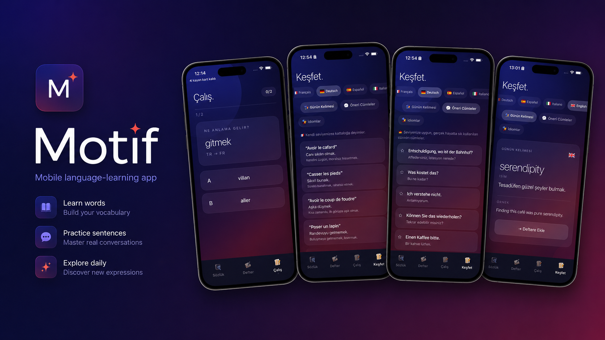

  

# Motif

Motif is a mobile language-learning app prototype built with Expo and React Native.

It is designed around a simple workflow:

1. Search a word
2. Save useful vocabulary
3. Practice with study modes
4. Explore idioms, daily words, and useful sentences

## Current Features

- Multi-language theme system
- Vocabulary search flow
- Personal wordbook
- Study mode
- Explore section
- React Context state management
- iOS-inspired mobile UI

## Target Languages

- French
- German
- Spanish
- Italian
- English

## Tech Stack

- Expo
- React Native
- JavaScript
- React Context API

## Project Structure

motif-expo/
  App.js
  package.json
  package-lock.json
  src/
    context/
      ThemeContext.js
      WordbookContext.js
    screens/
      SozlukScreen.js
      DefterScreen.js
      CalisScreen.js
  screenshots/
    motif-hero.png

## Run Locally

Install dependencies:

npm install

Start the Expo development server:

npx expo start --lan --clear

## Status

This project is currently an early mobile app prototype.

The goal is to turn the original UI concept into a polished iOS and Android application.

## Roadmap

- Improve glassmorphism UI
- Add real search input
- Add local storage
- Add spaced repetition logic
- Expand study modes
- Prepare iOS and Android builds
